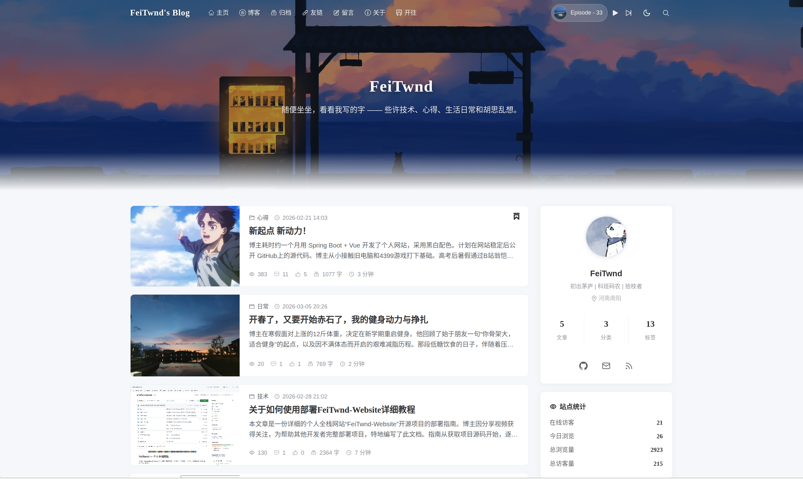
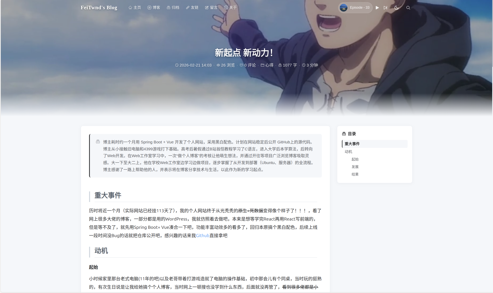
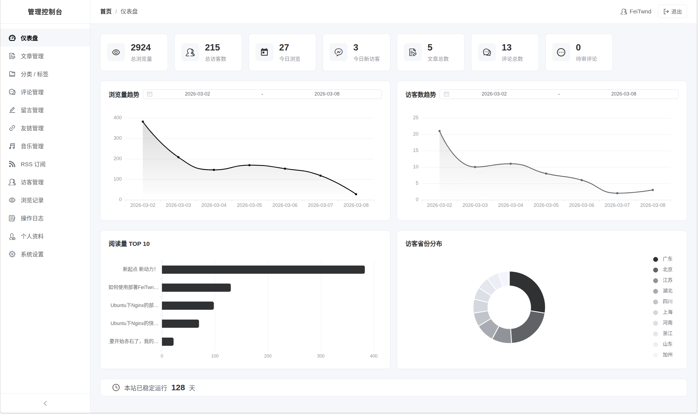
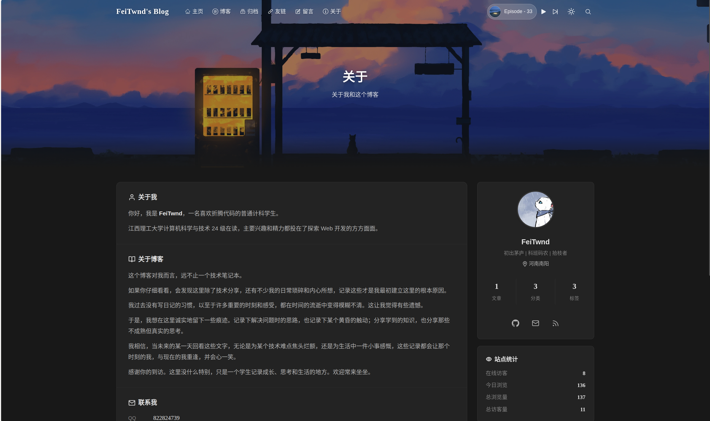

<p align="center">
  
  
  
  
  
  
  
  
</p>

# WuTao — 个人全栈网站

一套基于 **Spring Boot 3 + Vue 3 + Expo (React Native)** 的个人网站全栈解决方案，包含博客、后台管理、个人主页、在线简历四个 Web 子站点、一个移动端管理 App，以及一个统一后端服务。

> 在线演示：[blog.wutao.cc](https://blog.wutao.cc) · [wutao.cc](https://wutao.cc) · [cv.wutao.cc](https://cv.wutao.cc)

---

## 功能特性

### 博客端 (Frontend-Blog)
- Markdown 文章渲染（md-editor-v3 预览，与管理端编辑效果一致）
- 文章分类 / 标签 / 归档 / 全文搜索
- 评论系统（嵌套回复、Markdown、悄悄话、邮件通知）
- emoji 表情选择器
- 留言板（独立于文章的留言系统）
- 友情链接
- 文章点赞
- RSS Feed（XML 订阅源）
- 自动目录提取（TOC）
- 暗黑模式（跟随系统 / 手动切换）
- 响应式设计（移动端适配）
- 访客指纹识别（无需登录即可评论/点赞）
- 城市足迹地图（ECharts 中国地图，已访城市标记、点击查看城市图集）
- 城市图集页（胶片滚动动效、灯箱预览、移动端手动拖动）
- 首页背景音乐播放

### 管理端 (Frontend-Admin)
- 文章管理（Markdown 编辑器、封面上传、分类/标签管理）
- 评论 / 留言审核管理
- 友情链接管理
- emoji 表情选择器
- 音乐管理
- 城市足迹管理（已访城市标记、图集上传管理）
- 个人信息 / 社交媒体管理
- 访客统计 / 数据看板（ECharts）
- 系统配置（站点设置、关于页面、模块开关）
- 操作日志
- AI 摘要生成（可选扩展模块：写文章时可勾选，发布后异步调用大模型生成摘要并回填）

### 个人主页 (Frontend-Home)
- 个人信息展示
- 社交媒体链接
- 简洁大气的单页设计

### 在线简历 (Frontend-Cv)
- 教育 / 工作 / 项目经历展示
- 技能标签
- 响应式布局，适合分享

### 移动端管理 App (App)
- Expo (React Native) 移动端管理后台，与管理端共用后端接口
- 登录（用户名 + 密码 + 邮箱验证码）
- 数据看板（访问统计、趋势图、省份分布、热门文章 Top 10）
- 评论 / 留言待审核提醒（前台轮询 + 本地通知）
- 文章管理
- 个人信息 / 城市足迹管理
- 暗黑模式（跟随系统）

---

## 技术架构

```
┌─────────────────────────────────────────────────────────┐
│                      Nginx 反向代理                       │
│  blog.xxx.cc  home.xxx.cc  cv.xxx.cc  admin.xxx.cc      │
└────┬──────────────┬───────────┬──────────────┬──────────┘
     │              │           │              │
     ▼              ▼           ▼              ▼
 Frontend-Blog  Frontend-Home  Frontend-Cv  Frontend-Admin
 (Vue 3+Vite)  (Vue 3+Vite)  (Vue 3+Vite)  (Vue 3+Vite)
     │              │           │              │
     └──────────────┴───────────┴──────────────┘
                        │  /api
                        ▼
              ┌──────────────────┐
              │  Spring Boot 3   │
              │   (Backend)      │
              │   Port: 5922     │
              └───┬─────────┬────┘
                  │         │
          ┌───────┘         └────────┐
          ▼                          ▼
    ┌──────────┐              ┌──────────┐
    │  MySQL 8 │              │ Redis 7  │
    └──────────┘              └──────────┘
          │
    ┌─────┘
    ▼
 Aliyun OSS (图片/文件存储)
```

移动端管理 App（Expo/React Native）通过 HTTPS 调用后端 API（Nginx `api` 子域名反向代理），与四个 Web 子站共用同一套后端服务。

### 后端技术栈

| 技术 | 说明 |
|---|---|
| Spring Boot 3.5 | 应用框架 |
| Java 21 | 开发语言 |
| MyBatis + PageHelper | ORM + 分页 |
| MySQL 8 + Druid | 数据库 + 连接池 |
| Redis | 缓存 + Session |
| Spring Cache | 缓存抽象 |
| JWT (JJWT 0.12) | 认证授权 |
| Knife4j (OpenAPI 3) | API 文档 |
| Aliyun OSS SDK | 对象存储 |
| WebSocket | 实时通信（在线人数） |
| Bucket4j | 接口限流 |
| CommonMark + Jsoup | Markdown 解析 + HTML 清洗 |
| Thumbnailator + WebP | 图片压缩 |
| Spring Mail | 邮件发送 |

### 前端技术栈

| 技术 | 说明 |
|---|---|
| Vue 3.5 | 前端框架 |
| Vite 7 | 构建工具 |
| Vue Router 4 | 路由 |
| Pinia 3 + Persisted State | 状态管理 + 持久化 |
| Element Plus | UI 组件库 |
| md-editor-v3 | Markdown 编辑/预览 |
| ECharts | 数据可视化（管理端） |
| Axios | HTTP 客户端 |
| Sass | CSS 预处理器 |
| Expo (React Native) | 移动端管理 App 框架 |

---

## 项目结构

```
WuTao/
├── Backend/                    # Spring Boot 后端
│   ├── WuTao-common/         # 公共模块（工具类、常量、异常）
│   ├── WuTao-pojo/           # 实体/DTO/VO
│   ├── WuTao-extension-api/  # 扩展模块契约层（可插拔模块与主程序间的接口）
│   ├── WuTao-ai/             # AI 摘要模块（可选，-Pwith-ai 构建时打包）
│   └── WuTao-server/         # 主服务（Controller、Service、Mapper）
│       └── src/main/resources/
│           ├── application.yml.template      # 配置模板
│           ├── application-dev.yml.template   # 开发环境模板
│           ├── application-prod.yml.template  # 生产环境模板
│           ├── application-docker.yml         # Docker 环境配置
│           ├── database/wutao.sql           # 数据库建表脚本
│           └── mapper/                        # MyBatis XML
├── Frontend-Blog/              # 博客前端
├── Frontend-Admin/             # 管理后台前端
├── Frontend-Home/              # 个人主页前端
├── Frontend-Cv/                # 在线简历前端
└── App/                        # 移动端管理 App（Expo / React Native）
```

---

## 快速开始

### 环境要求

| 环境 | 版本要求 |
|---|---|
| JDK | 21+ |
| Maven | 3.9+ |
| Node.js | 20.19+ 或 22.12+ |
| pnpm | 9+ |
| MySQL | 8.0+ |
| Redis | 7+ |

### 1. 克隆项目

```bash
git clone https://github.com/WuTao/WuTao-Website.git
cd WuTao
```

### 2. 初始化数据库

```bash
# 创建数据库并导入建表脚本
mysql -u root -p -e "CREATE DATABASE WuTao DEFAULT CHARACTER SET utf8mb4 COLLATE utf8mb4_unicode_ci;"
mysql -u root -p WuTao < Backend/WuTao-server/src/main/resources/database/wutao.sql
```

### 3. 配置后端

```bash
cd Backend/WuTao-server/src/main/resources

# 从模板复制配置文件
cp application.yml.template application.yml
cp application-dev.yml.template application-dev.yml

# 编辑 application.yml，填入你的配置：
# - 数据库用户名/密码
# - Redis 密码
# - JWT 密钥
# - 阿里云 OSS 配置
# - QQ 邮箱 + 授权码
# - 网站地址
```

<details>
<summary>需要配置的项目清单</summary>

| 配置项 | 位置 | 说明 |
|---|---|---|
| `spring.datasource.password` | application.yml | MySQL 密码 |
| `spring.redis.password` | application.yml | Redis 密码（无密码则留空） |
| `wutao.jwt.secret-key` | application.yml | JWT 签名密钥（随机字符串即可） |
| `wutao.alioss.*` | application.yml | 阿里云 OSS 配置 |
| `spring.mail.username` | application.yml | QQ 邮箱地址 |
| `spring.mail.password` | application.yml | QQ 邮箱授权码 |
| `wutao.email.personal` | application.yml | 发件人昵称 |
| `wutao.email.from` | application.yml | 发件人邮箱 |
| `wutao.email.admin-notify-to` | application.yml | 接收新评论和留言通知的站长邮箱 |
| `wutao.visitor.verify-code` | application.yml | 访客验证码 |
| `wutao.website.*` | application.yml | 网站标题和 4 个子站地址 |
| `wutao.jwt.ttl` | application-dev.yml | JWT 过期时间（毫秒） |
| `wutao.datasource.*` | application-dev.yml | 数据库连接信息 |
| `wutao.redis.*` | application-dev.yml | Redis 连接信息 |

</details>

### 4. 启动后端

```bash
cd Backend
mvn clean package -DskipTests
java -jar WuTao-server/target/WuTao-server-1.0-SNAPSHOT.jar --spring.profiles.active=dev
```

### 5. 启动前端（开发模式）

每个前端项目都可以独立启动：

```bash
# 博客端
cd Frontend-Blog
pnpm install
pnpm dev

# 管理端
cd Frontend-Admin
pnpm install
pnpm dev

# 主页
cd Frontend-Home
pnpm install
pnpm dev

# 简历
cd Frontend-Cv
pnpm install
pnpm dev
```

所有前端默认通过 Vite 代理将 `/api` 请求转发到 `http://localhost:5922`。

### 6. 访问

| 服务 | 地址 |
|---|---|
| 博客端 | http://localhost:5173 |
| 管理端 | http://localhost:5174 |
| 主页 | http://localhost:5175 |
| 简历 | http://localhost:5176 |

> 首次使用需要在数据库管理员账号或访客账号（如果需要），然后在管理端配置个人信息等内容。

### 7. 移动端 App（可选）

`App/` 是移动端管理后台，与四个 Web 子站共用后端接口，通过 EAS 云端打包成 APK 安装到手机，不需要本地 Android 环境：

```bash
cd App
pnpm install
npx eas-cli build -p android --profile preview
```

详细的首次配置（EAS 项目关联、服务器地址、图标替换）见 [App/BUILD.md](App/BUILD.md)。

---

## 生产部署

### 后端打包

```bash
cd Backend
mvn clean package -DskipTests
# 产出：WuTao-server/target/WuTao-server-1.0-SNAPSHOT.jar

# 使用生产环境配置启动
java -jar WuTao-server-1.0-SNAPSHOT.jar --spring.profiles.active=prod
```

### AI 摘要模块（可选扩展）

管理端写文章时可勾选"AI 生成摘要"，发布后后端异步调用大模型生成约 100 字摘要并回填，无需手动复制文章去网页版 AI。

该模块是**可插拔扩展**：默认构建不包含任何 AI 相关依赖（jar 体积不变），需要时以 `-Pwith-ai` 构建即可：

```bash
cd Backend
mvn clean package -DskipTests -Pwith-ai
```

> 重要：**打包是否包含 AI 模块由构建期的 Maven profile（`with-ai`）决定，与配置文件里的 `wutao.ai.enabled` 无关**——`enabled` 只控制运行时是否启用，改它不会改变 jar 体积。
>
> **使用 IDEA 打包**：打开右侧 Maven 面板，在 "Profiles" 分组里勾选 `with-ai`（等价于命令行 `-Pwith-ai`），点击刷新（Reload All Maven Projects）后重新打包即可；不勾选则产出不含 AI 的 jar。命令行与 IDEA 两种方式效果一致，二选一。

启用后需在配置文件（或环境变量）中填写模型参数，支持任意 OpenAI 兼容协议的服务（DeepSeek / 通义 / 智谱 / Kimi / OpenRouter / Ollama 等），切换模型厂商只需改配置：

```yaml
wutao:
  ai:
    enabled: true                          # 是否启用 AI 摘要生成
    base-url: https://api.deepseek.com/v1  # 模型接口地址（OpenAI 兼容协议）
    api-key: ${AI_API_KEY}                 # API 秘钥，通过环境变量注入，勿写死在 yml
    model-name: deepseek-chat              # 模型名称
    temperature: 0.3                       # 采样温度
    timeout-seconds: 60                    # 请求超时（秒）
```

> 各 AI 功能（摘要、后续的错别字修正等）的提示词存放在 ai 模块内部 `prompt` 包下的独立常量类（如 `WuTao-ai/.../ai/prompt/ArticleSummaryPrompt.java`，一个功能一个常量类），不在 yml 中配置，新增功能时在模块内扩展即可。

使用说明：
- 管理端编辑页在"摘要"输入框下方出现"AI 生成摘要"开关；后端未打包该模块或未启用时，开关自动隐藏；
- 勾选后点击发布：发布接口正常返回，摘要异步生成回填，稍后刷新页面可见；
- 已有手写摘要时不触发 AI 生成，不会覆盖手动填写的内容；
- AI 服务不可用时只记录日志，不影响文章发布。

**AI 错别字 / 病句纠错**（与摘要同一可插拔模块，`-Pwith-ai` 构建后启用）：
- 编辑页顶部"返回"与"保存草稿"之间出现"AI 纠错"按钮（未打包或未启用时隐藏）；
- 点击后将当前文章 Markdown 发给 AI，弹窗内以红（删除 -）/绿（新增 +）逐行对比纠错前后的内容；
- 每个变更块可勾选：勾选 = 采纳 AI 修改，不勾选 = 保留原文；确认后整体替换编辑器内容；
- 提示词位于 ai 模块 `prompt` 包下的 `TypoCorrectionPrompt` 常量类。

### 前端打包

```bash
# 以博客端为例（其余三个同理）
cd Frontend-Blog
pnpm install
pnpm build
# 产出：dist/ 目录，部署到 Nginx 对应站点即可
```

### 移动端 App

App 通过 EAS 云端构建产出可直接安装的 APK，打包流程见 [App/BUILD.md](App/BUILD.md)。

### Nginx 配置参考

```nginx
# 博客端
server {
    listen 80;
    server_name blog.yourdomain.com;
    root /path/to/Frontend-Blog/dist;
    index index.html;

    location / {
        try_files $uri $uri/ /index.html;
    }

    location /api/ {
        proxy_pass http://127.0.0.1:5922/;
        proxy_set_header Host $host;
        proxy_set_header X-Real-IP $remote_addr;
        proxy_set_header X-Forwarded-For $proxy_add_x_forwarded_for;
    }

    # WebSocket 支持（在线人数）
    location /api/ws/online {
        proxy_pass http://127.0.0.1:5922/ws/online;
        proxy_http_version 1.1;
        proxy_set_header Upgrade $http_upgrade;
        proxy_set_header Connection "upgrade";
    }
}

# 其他子站（home / admin / cv）配置类似，修改 server_name 和 root 即可
```

### 部署到子路径（可选）

本项目默认按**多站点**方式部署：每个前端跑在独立域名（或子域名）的根路径下，`base` 保持 `/`，路由使用 history 模式，URL 干净无 `#`，上面的 Nginx 配置即为此场景。

如果你不想用多站点，希望把某个前端部署到同一域名的子路径（如 `https://yourdomain.com/admin/`），**无需改动源码**，只要在构建时通过 `--base` 指定子路径即可：

```bash
# 以管理端部署到 /admin/ 为例
cd Frontend-Admin
pnpm build --base=/admin/
# 产出的 dist 内资源引用会带上 /admin/ 前缀
```

对应的 Nginx 用 `alias` 指向子路径目录，并把 `try_files` 的回退指到该子路径下的 `index.html`：

```nginx
server {
    listen 80;
    server_name yourdomain.com;

    location /admin/ {
        alias /path/to/Frontend-Admin/dist/;
        try_files $uri $uri/ /admin/index.html;
    }

    location /api/ {
        proxy_pass http://127.0.0.1:5922/;
        proxy_set_header Host $host;
        proxy_set_header X-Real-IP $remote_addr;
        proxy_set_header X-Forwarded-For $proxy_add_x_forwarded_for;
    }
}
```

> `--base` 的取值必须和 Nginx 里的子路径一致（含首尾斜杠，如 `/admin/`）；换部署路径时重新用对应的 `--base` 构建即可。这样既保留了默认多站点用法的干净 URL，也能满足单域名子路径部署的需求。

---

## Docker 部署

项目支持 Docker 容器化部署。

```bash
# 构建并启动所有服务
docker compose up -d --build

# 查看服务状态
docker compose ps

# 查看日志
docker compose logs -f
```

> Docker 镜像基于 `eclipse-temurin:21-jre-alpine` 运行后端，前端通过 Nginx 容器托管。**完整的 Docker 部署步骤（环境变量、数据库自动初始化、前端静态文件、HTTPS 等）见 [docker/README.md](docker/README.md)。**

如需在 Docker 部署中启用 AI 摘要模块，在 `.env` 文件中设置 `AI_ENABLED=true` 并填写 `AI_API_KEY` 等参数后重新构建镜像即可（默认不打包 AI 模块）。

---

## 效果预览


| 博客首页 | 文章详情 |
|:---:|:---:|
|  |  |

| 管理后台 | 暗黑模式 |
|:---:|:---:|
|  |  |


---

## 贡献

欢迎提交 Issue 和 Pull Request！详见 [CONTRIBUTING.md](CONTRIBUTING.md)。

## 开源协议

本项目采用 [MIT](LICENSE) 协议开源。

## Star History

如果这个项目对你有帮助，欢迎 Star 支持一下！
